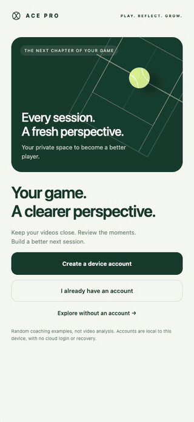
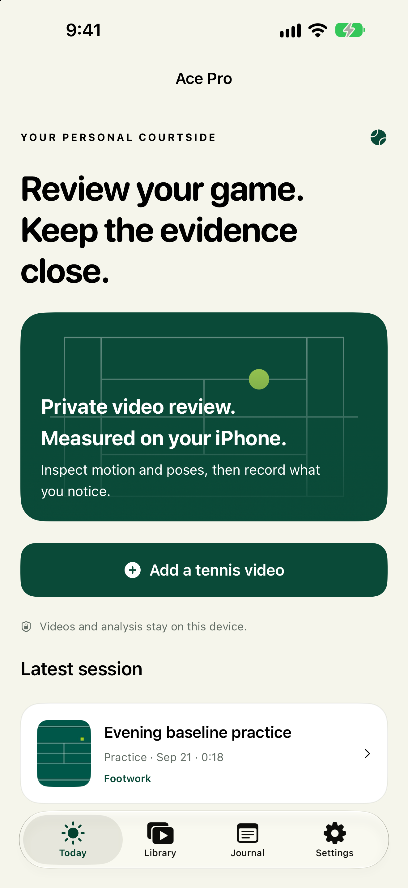
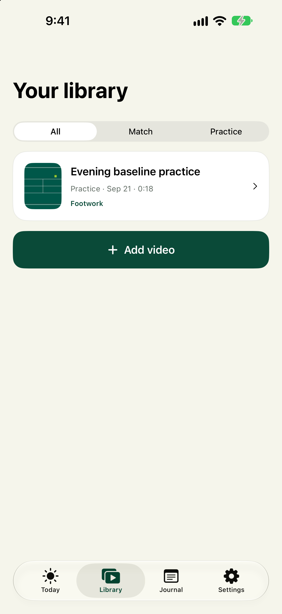
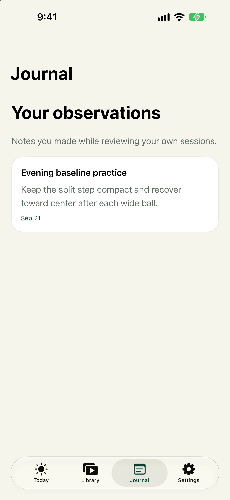
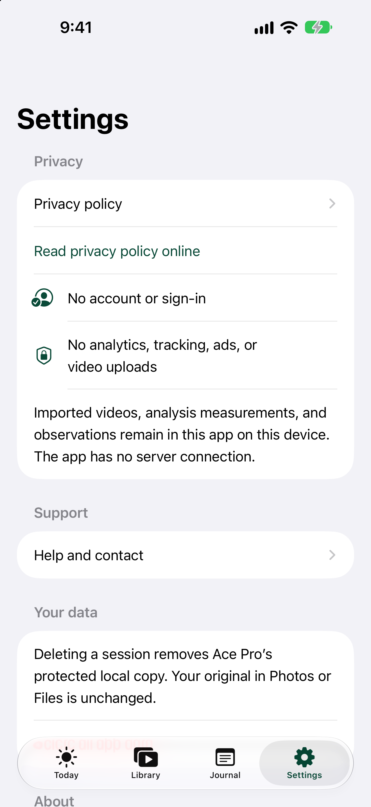

# Ace Pro

Ace Pro is an early-stage tennis match analysis project. The goal is to turn ordinary match video into useful statistics and searchable clips that help players understand patterns in their game without manually reviewing an entire recording.

The initial direction is to focus on full-match analysis for players, with coaches as a secondary user group. Before defining the MVP, the project will validate which insights are genuinely useful and which tennis events current AI video models can detect reliably.

## Experience walkthrough

A walkthrough of the mobile browser experience: create a device account, import a local video, explore sample insights, replay timestamps, save drills and notes, and review related moments across sessions.

[](./docs/media/ace-pro-walkthrough.mp4)

**[Watch the full MP4 walkthrough](./docs/media/ace-pro-walkthrough.mp4)** · [Still preview](./docs/media/ace-pro-poster.png) · [Re-recording instructions](./tools/recording/README.md)

Recorded with a demo account and generated court footage. This is the browser preview, not an iOS Simulator capture. Insights and timestamps are simulated; video stays on-device.

## Video storage implementation

The first backend slice implements resumable direct-to-object-storage video transfer with FastAPI, PostgreSQL, local MinIO testing, and production-shaped AWS Terraform. See the [backend runbook](./backend/README.md) and [storage design](./docs/video-storage-design.md).

## On-device iOS review experience

The native SwiftUI app in [`ios`](./ios) is the App Store release candidate. It has no account or server dependency. It includes Photos/Files import, a persistent protected local video library, timestamp playback, a private observation journal, in-app privacy controls, and real Apple Vision measurement directly on the iPhone:

- parabolic motion-candidate tracking with detected time ranges;
- 2D and 3D human body pose estimation;
- hand-pose estimation;
- optical-flow sampling for camera and scene motion;
- exact-frame pose review and bounded playback for motion candidates; and
- optional Apple Intelligence summaries generated from measured results on supported devices.

The built-in Apple algorithms provide measurements, not tennis semantics. Motion candidates are not verified tennis balls, and serve/forehand/backhand labels require separately trained and evaluated Core ML models. Video frames remain on the device. See the [native iOS instructions](./ios/README.md), [App Store submission checklist](./docs/app-store-submission.md), and [phased on-device analysis plan](./docs/video-analysis/14-on-device-analysis.md).

### App Store preview

These iPhone screenshots show the native release-candidate experience with representative data stored locally on the simulator. They are also kept as the source assets for the App Store listing.

| Today | Library | Journal | Settings |
| --- | --- | --- | --- |
|  |  |  |  |

Run the working local experience and its single API:

```sh
node insights-api/server.mjs
```

Open http://localhost:8787. This is a separate browser prototype with clearly labeled simulated reports; it is not linked into the native App Store build. See the [API/preview runbook](./insights-api/README.md), [native iOS instructions](./ios/README.md), and [release boundary](./docs/app-store-experience.md).

## Video analysis architecture

The proposed hybrid, evidence-backed analysis architecture is recorded in [ADR-0001](./docs/adr/0001-hybrid-evidence-backed-video-analysis.md). Its implementation contracts are split into the [video-analysis technical specifications](./docs/video-analysis/README.md), covering orchestration, media processing, quality checks, vision inference, tennis events, insights, clips, corrections, APIs, operations, and evaluation.

## Model evaluation harness

The first existing-model adapter and evaluation workflow lives in [`ml`](./ml). It pins TrackNetV4,
normalizes ball predictions, renders review overlays, validates match/player-isolated dataset splits,
and reports component metrics. Real-footage inference requires a provenance-tracked tennis checkpoint;
the upstream project does not currently publish one through its documented links.

## Next action items

- Interview a tennis coach about how they evaluate players and review match footage.
- Interview at least one additional player about useful post-match information.
- Research comparable sports analytics products and how they provide value.
- Select three to five candidate statistics for the first feasibility tests.
- Find or record representative tennis match footage from realistic camera angles.
- Test multiple AI/video models on specific tennis events.
- Document model accuracy, limitations, and camera requirements.
- Use the discovery and experiment results to define the MVP scope.

## Project activity log

Discovery notes, technical experiments, and development milestones are documented in the [activity log](./docs/activity-log/README.md).
