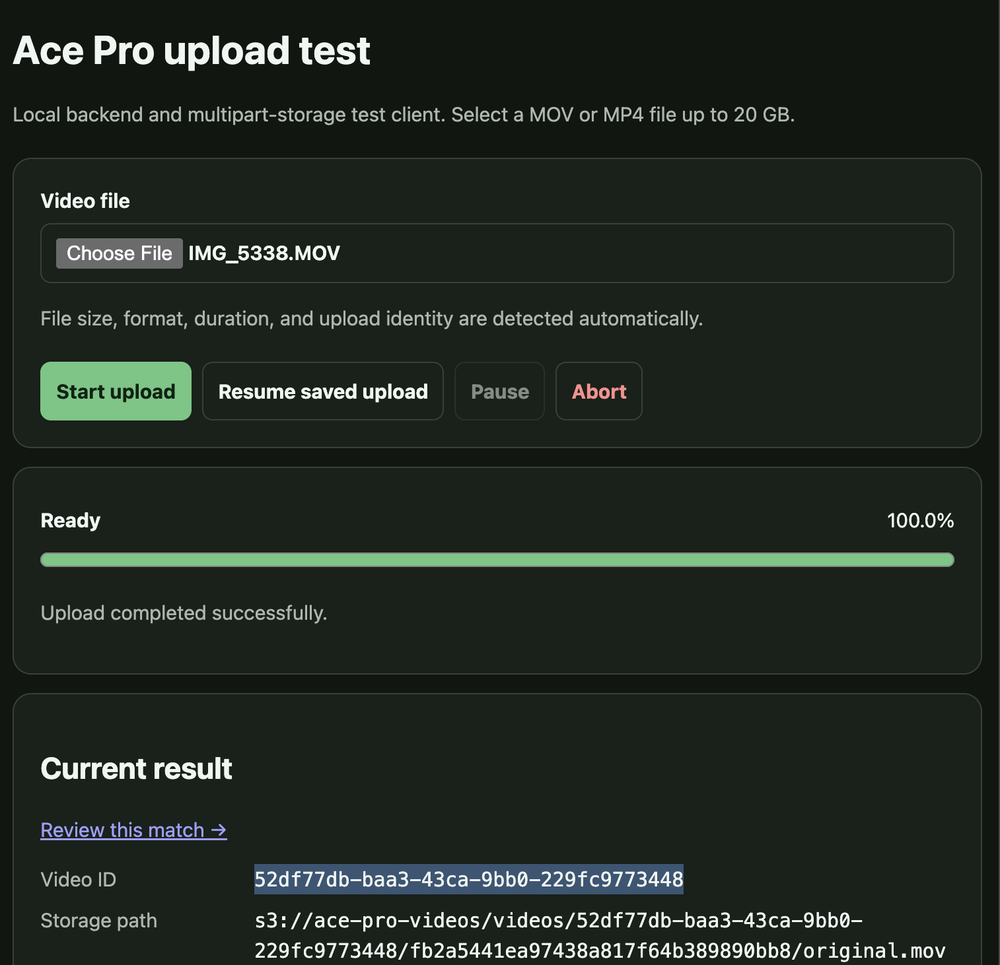
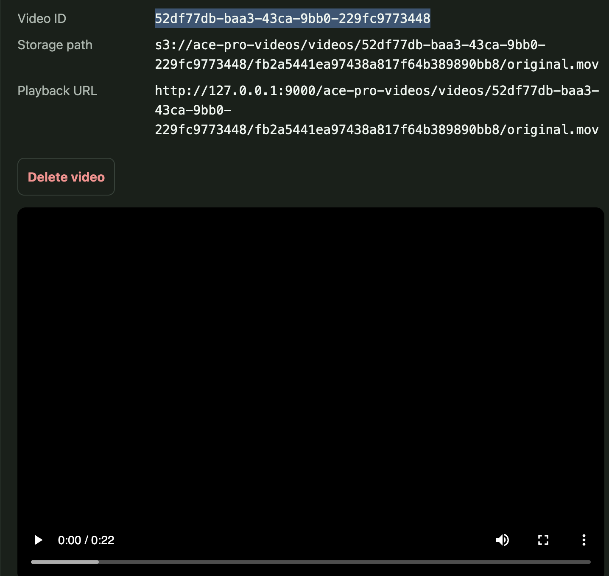

# Browser Analysis Review

**Date:** September 17, 2026  
**Phase:** Development

## Goal

Make the existing manual analysis workflow accessible for reviewing match evidence and correcting events with my teammates and coach.

## What I did

Added a browser review screen at `/analysis-review` and linked it from completed uploads. The screen creates or loads an analysis, imports reviewed point annotations, displays short/deep backhand return results, plays evidence clips, and saves corrections to stroke, landing zone, and point winner. Corrections refresh the report and use the API's revision checks to prevent stale edits from overwriting a newer review.

## Key findings

- The repository already contains the upload API and manual analysis service needed for this workflow.
- TrackNet evaluation exists, but the documented missing checkpoint still prevents claiming working automatic inference.
- The review screen can exercise the evidence and correction workflow independently of model readiness.

## What changed

Previously, reviewing and correcting this analysis required direct API requests. I can now perform those steps through a browser. The report explicitly identifies the use of human annotations so it does not imply that AI detected these events.

## Upload screenshots

These screenshots supplied during local testing show a completed upload and the resulting storage and playback details. They document the upload interface; they do not establish automatic analysis accuracy or successful video decoding.

## Open questions

- Does this evidence presentation help my coach identify a practice priority?
- How much annotation and correction effort is acceptable?
- Which validated model can supply the next set of event predictions?

## Next steps

- Run the database and storage services, upload real footage, and import annotations that match its timestamps.
- Review the clips and corrections with my coach.
- Obtain and evaluate the model checkpoint before connecting automatic detection.
