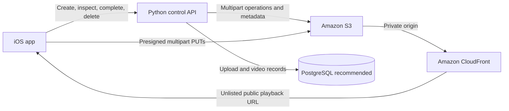

# Ace Pro Video Storage Design

Status: **Design confirmed; implementation not started**  
Last updated: **August 2026**

This document is the implementation handoff for Ace Pro's long-form tennis-match video upload and storage feature. A future AI or engineering session should treat the decisions marked **Confirmed** as requirements. Items marked **Deferred** are deliberately out of scope and must not be silently invented during implementation.

## 1. Goal

Allow an Ace Pro user to:

1. Select a tennis-match video from the iPhone Photos library.
2. Upload a long video directly from the phone to cloud object storage.
3. See upload progress based only on transferred file bytes.
4. Resume an interrupted upload after network loss, app termination, or device restart.
5. Receive both:
   - a durable storage path identifying the stored object; and
   - an unlisted public URL that can be played by the iOS application.
6. Delete the video later and have its playback URL stop working after a short propagation window.

## 2. Confirmed product requirements

| Area | Confirmed requirement |
| --- | --- |
| Client | Native iOS application |
| Video source | Existing asset selected from the iPhone Photos library |
| Backend | Python API |
| Accepted containers | MOV (`.mov`) and MP4 (`.mp4`) |
| Accepted video codecs | H.264/AVC and HEVC/H.265 |
| Maximum duration | 3 hours |
| Maximum file size | 20 GB |
| Upload method | Resumable multipart upload directly from iOS to object storage |
| Progress meaning | File-transfer bytes only; it excludes validation and any future processing |
| Resume window | 24 hours from creation of the upload session |
| Cloud provider | AWS |
| Object storage | Amazon S3 in a US region |
| Playback delivery | Amazon CloudFront |
| Visibility | Unlisted public playback: anyone with the URL can watch, but videos are not publicly listed or searchable |
| API result | Return both the S3 storage path and a separate CloudFront playback URL |
| Retention | Retain completed originals indefinitely until the owning user deletes them |
| Deletion | Remove the S3 object and invalidate the CloudFront path |
| Deletion propagation | Several seconds is acceptable; deletion is not atomically instantaneous across all edge locations |
| Expected usage | 10 users per day, approximately 10 videos per user per day |
| Quotas | The expected usage numbers are capacity estimates, not enforced user limits |
| Geographic audience | United States |
| Metadata database recommendation | PostgreSQL, preferably Amazon RDS for PostgreSQL; detailed database design is deferred |

## 3. Explicitly deferred or out of scope

The implementation must not design these areas unless the user expands the scope:

- User authentication and identity-provider selection.
- Exact Python framework.
- Exact API route names and wire format.
- Detailed PostgreSQL schema, database sizing, or database deployment.
- Video analysis, transcoding, normalization, thumbnails, previews, or derived clips.
- Downstream processing events or queues.
- Public discovery, search, feeds, or listing pages.
- Infrastructure provisioning choices such as Terraform, CDK, or CloudFormation.
- Selection of the exact AWS US region. The S3 bucket, CloudFront origin, Python API, and eventual database should be colocated appropriately when backend hosting is decided.

Authentication is out of scope, but every control-plane operation must have an authorization boundary in its interface. Implementation may use an existing project authentication mechanism if one exists; it must not invent a new authentication system as part of this feature.

## 4. Architecture decision

Use separate control and data planes.

### 4.1 Control plane

The iOS app sends small requests to the Python API to:

- create an upload session;
- request time-limited authorization for upload parts;
- inspect/reconcile multipart state during resume;
- complete an upload;
- abort an upload;
- retrieve the resulting references; and
- delete a completed video.

The Python API communicates with S3 and the metadata database. It must not proxy the video payload.

### 4.2 Data plane

The iOS app uploads video parts directly to Amazon S3 using time-limited, narrowly scoped presigned URLs. This prevents a multi-gigabyte file from consuming Python API bandwidth, memory, worker time, or request duration.

After completion, playback goes from CloudFront to the iOS player. CloudFront reads the original object from S3. The S3 bucket itself must not allow arbitrary public writes.



## 5. Storage and URL model

### 5.1 Object identity

Each upload must receive an opaque video identifier and a non-guessable object key. Do not build the object key solely from a username, original filename, or sequential integer.

The exact key layout may be selected during implementation, but it must support:

- stable lookup by video ID;
- ownership association;
- safe handling of duplicate filenames;
- deletion of exactly one video's objects; and
- an unguessable public playback path.

The original client filename is metadata and must not be trusted as a path.

### 5.2 Returned references

On successful completion, the API returns two distinct values:

- `storage_path`: a durable S3 reference, such as an `s3://` URI or an equivalent bucket-plus-key representation.
- `playback_url`: an HTTPS CloudFront URL suitable for the iOS player.

The iOS app must not attempt to play the `s3://` storage path directly.

### 5.3 Visibility

The playback URL is **unlisted public**, not private:

- anyone who obtains the URL can watch the video;
- it does not require a signed viewer URL under the confirmed design;
- the product must not expose a public listing or search index;
- the key must be difficult to guess; and
- unlisted access must not be described as confidential or access-controlled.

CloudFront should be the playback entry point. Keep direct S3 read access restricted to the CloudFront origin configuration where practical.

## 6. Upload lifecycle

### 6.1 State model

The logical upload states are:

```text
pending -> uploading -> paused -> uploading -> completing -> ready
                    \-> expired
                    \-> aborted
                    \-> failed
```

State names may differ in code, but the behavior must be representable.

### 6.2 Create upload

The iOS app reads metadata from the selected Photos asset and sends declared metadata to the Python API. At minimum, the create request needs:

- original filename, if available;
- byte size;
- duration;
- container/file type;
- video codec, if available;
- a client-side file/asset fingerprint suitable for detecting that the selected source changed; and
- any existing user/owner context supplied by the application's authentication layer.

Before creating an S3 multipart upload, reject a declared file that is:

- larger than 20 GB;
- longer than 3 hours;
- not MOV or MP4; or
- not H.264 or HEVC.

The service creates:

- an opaque video ID;
- a non-guessable S3 object key;
- an S3 multipart upload ID;
- a 24-hour upload-session expiration time; and
- an initial metadata record.

### 6.3 Upload parts

The API returns or later issues presigned URLs for numbered S3 multipart-upload parts.

Requirements:

- The URLs must expire and authorize only the intended bucket, key, upload ID, and part number.
- The iOS app uploads directly to S3.
- The iOS app records the completed part number and returned part identifier/ETag.
- Failed parts can be retried independently.
- Concurrency, part size, retry backoff, and URL batch size are implementation parameters and should be chosen deliberately rather than embedded as product requirements.
- The S3 multipart constraints must be respected, including the maximum part count and minimum non-final part size.

### 6.4 Progress calculation

The displayed progress bar measures transfer only:

```text
progress = confirmed uploaded bytes / total file bytes
```

Progress requirements:

- Count bytes confirmed for completed parts.
- The currently transferring part may contribute its reported in-flight bytes if the client networking API provides them reliably.
- Do not include time for API calls, S3 assembly, validation, CloudFront availability, or future video processing.
- Do not show 100% until all file bytes have been uploaded. A separate short `Completing upload` state may appear while S3 assembles the object.
- After resume/reconciliation, rebuild progress from server/S3-confirmed parts so the UI does not overstate completion.

### 6.5 Complete upload

When every part is uploaded:

1. The iOS app submits the ordered completed-part list to the Python API.
2. The API asks S3 to complete the multipart upload.
3. The API verifies that S3 reports successful completion.
4. The service records the object as ready and stores its final size and references.
5. The API returns `storage_path` and `playback_url`.

Completion must be idempotent from the client's perspective. Retrying after a lost API response must return the already-completed result instead of creating a duplicate object.

## 7. Resume behavior

Resume support is required across:

- temporary network loss;
- application backgrounding or termination; and
- device restart.

The iOS client must persist enough state to resume, including:

- video ID;
- S3 multipart upload ID or an opaque server-side session reference;
- object key or opaque upload reference;
- upload-session expiration;
- file/Photos asset identity and fingerprint;
- total byte size;
- chosen part size;
- completed part numbers and their identifiers; and
- current logical state.

Resume sequence:

1. Load the locally persisted upload session.
2. Confirm that the original Photos asset is still available.
3. Confirm that the source asset still matches its saved fingerprint and size.
4. Ask the API for the authoritative multipart status.
5. Reconcile local part records with the parts S3 recognizes.
6. Recalculate confirmed uploaded bytes.
7. Request fresh presigned URLs for missing parts.
8. Upload only the missing parts.
9. Complete normally.

If the Photos asset was removed or changed, the existing session cannot safely resume. Present a failure/restart path rather than uploading different bytes under the same multipart session.

## 8. Expiration and abandoned uploads

An incomplete upload remains resumable for 24 hours from session creation.

After expiry:

- the API must stop issuing new part URLs for that session;
- the session becomes expired;
- the multipart upload must be aborted; and
- the user must start a new upload from the beginning.

Configure an S3 lifecycle rule or an equivalent cleanup mechanism to abort incomplete multipart uploads after the allowed window. Ensure application/session cleanup and S3 cleanup agree closely enough that expired sessions are not presented as resumable.

Completed video objects must not inherit the 24-hour cleanup rule.

## 9. Validation and integrity

Client-side validation is useful for immediate feedback but is not a security boundary. The service must not trust only client-declared metadata.

The storage-layer implementation must at minimum verify after completion:

- the final object exists;
- its byte size is at most 20 GB; and
- completion belongs to the expected bucket/key/upload session.

Strict authoritative inspection of duration and codec may require reading media metadata after upload. That borders on video processing, which is currently out of scope. The implementation session must explicitly identify whether initial enforcement of duration and codec is client-declared only or whether lightweight server-side media inspection is being added to scope. Do not silently add a transcoding pipeline.

Use integrity protection supported by the selected S3 upload flow. The exact checksum algorithm and iOS computation strategy are implementation choices, but corruption detection must be considered for multi-gigabyte uploads.

## 10. Conceptual API capabilities

Exact routes, schemas, and framework are deferred. The implementation must provide the following capabilities.

| Capability | Purpose | Minimum result |
| --- | --- | --- |
| Create upload | Validate metadata and create the multipart session | Video ID, session/upload reference, expiry, object reference, part strategy |
| Authorize parts | Grant time-limited permission to upload numbered parts | Presigned URLs and expiry |
| Inspect upload | Support resume and reconciliation | State plus S3-confirmed completed parts |
| Complete upload | Assemble parts and publish the result | `storage_path`, `playback_url`, ready state |
| Abort upload | Cancel an incomplete session | Aborted state and no retained multipart parts |
| Get video | Read the current video state and references | Metadata, lifecycle state, references when ready |
| Delete video | Remove storage and revoke playback | Deletion status and CloudFront invalidation status |

All mutating operations must be idempotent or accept an idempotency mechanism appropriate to the project's API conventions.

## 11. Conceptual metadata

Detailed database design is deferred. The chosen persistence layer must nevertheless be able to represent at least:

- video ID;
- owner/user reference;
- original filename;
- declared container and codec;
- declared duration;
- declared and final byte size;
- S3 bucket and object key;
- S3 multipart upload ID while incomplete;
- upload/session status;
- upload creation and expiration timestamps;
- completion timestamp;
- deletion timestamp/status;
- CloudFront playback path or enough information to derive it;
- relevant checksum/integrity metadata; and
- failure information safe to expose operationally.

Do not store the video binary in PostgreSQL.

Recommendation only: use PostgreSQL on Amazon RDS when the database layer is designed. This recommendation is not authorization to provision or design the database in the storage implementation task.

## 12. Playback

After a successful multipart completion:

- the API returns the CloudFront HTTPS URL;
- the iOS application uses that URL with the selected iOS playback component;
- S3 supports range reads needed for seeking through the original object; and
- CloudFront serves the original uploaded file without transcoding under this design.

The accepted H.264/HEVC in MOV/MP4 decision aligns with iPhone playback, but the implementation should test representative real Photos-library assets, including large HEVC files, before declaring playback complete.

Because there is no transcoding or HLS packaging in scope, startup time and seeking behavior depend on the structure of the original file. The feature must not promise adaptive bitrate streaming.

## 13. Deletion

User deletion must follow this behavior:

1. Verify through the application's existing authorization boundary that the caller may delete the video.
2. Make the video unavailable to normal application reads.
3. Abort the multipart upload if the video is still incomplete.
4. Delete the completed S3 object if it exists.
5. Submit a CloudFront invalidation for the video's playback path.
6. Record deletion outcome/status for operational recovery.

The confirmed requirement accepts that CloudFront invalidation takes several seconds to propagate. A download already in progress cannot be recalled. After propagation, new requests to the deleted playback URL must fail.

Deletion must be idempotent: repeating a deletion request for an already-deleted or absent S3 object should converge on the deleted state.

## 14. Security requirements

- Never place permanent AWS credentials in the iOS application.
- Use short-lived presigned URLs limited to the intended multipart operation.
- Do not make the S3 bucket publicly writable.
- Prefer CloudFront origin access control so viewers access objects through CloudFront instead of a public S3 endpoint.
- Generate non-guessable video IDs/object paths for unlisted playback.
- Validate filenames and metadata; never concatenate an untrusted filename into a filesystem or object path without normalization.
- Limit API operations to the owning user's video through the existing authorization boundary.
- Avoid logging presigned URLs, credentials, or other bearer secrets.
- Apply server-side encryption at rest using an AWS-supported S3 encryption option selected during implementation.
- Use HTTPS for API, S3 uploads, and CloudFront playback.

Remember: an unlisted public URL is bearer access. It is not a private authorization mechanism.

## 15. Reliability and cleanup requirements

- Retrying a part must not corrupt or duplicate the final object.
- Retrying upload creation must not create uncontrolled duplicate sessions when the client repeats the same request after a timeout.
- Retrying completion must return the completed result when possible.
- Client and server state must be reconciled against S3 before resume.
- Expired multipart uploads must be aborted.
- A failed database update after S3 completion must be recoverable through reconciliation.
- A failed CloudFront invalidation must be retryable and observable.
- The system must not report a video as deleted while silently abandoning a recoverable deletion failure without operational status.

## 16. Observability requirements

The implementation should expose structured logs and metrics sufficient to diagnose:

- upload sessions created, completed, expired, aborted, and failed;
- bytes and part counts per upload;
- presigned-URL issuance failures;
- multipart completion failures;
- resume/reconciliation frequency and failures;
- S3 deletion failures;
- CloudFront invalidation requests and failures; and
- orphaned multipart-upload cleanup.

Logs should correlate events by opaque video ID/upload-session ID without logging presigned URLs.

## 17. Capacity context

Expected initial usage is approximately:

```text
10 users/day × 10 videos/user/day = 100 videos/day
```

This is planning context, not a product quota. Actual daily storage growth depends on real video sizes. At the maximum allowed size, the theoretical upper bound is 2 TB of new originals per day, so cost monitoring is required even though expected files may be smaller.

Because retention is indefinite until deletion, storage cost grows monotonically unless users delete videos. Playback also creates CloudFront/S3 data-transfer costs. The implementation should make bucket storage, request, transfer, and incomplete-part costs visible through normal AWS cost monitoring, but cost-alert configuration is not part of this design unless separately requested.

## 18. Acceptance criteria

The feature is complete only when all applicable criteria pass.

### Upload

- A supported video from Photos can be uploaded without its bytes passing through the Python API.
- Files above 20 GB are rejected before upload starts.
- Files declared longer than 3 hours are rejected before upload starts.
- Unsupported containers/codecs are rejected with a clear user-facing reason.
- The progress bar advances according to transferred bytes and reaches 100% only after all bytes transfer.
- The UI presents a separate completion state while S3 assembles the object if needed.

### Resume

- Disconnecting the network and reconnecting resumes missing parts.
- Terminating and relaunching the app within 24 hours resumes missing parts.
- Restarting the device within 24 hours resumes missing parts.
- Already completed parts are not uploaded again after authoritative reconciliation.
- A changed or missing Photos asset cannot resume under the old multipart session.
- A session older than 24 hours cannot resume and its incomplete S3 parts are cleaned up.

### Completion and playback

- Completion returns both a storage path and playback URL.
- Repeating completion after a lost response does not create a duplicate video.
- The returned CloudFront URL plays the completed original on the supported iOS target.
- The video does not appear in any public listing or search feature.
- A person possessing the URL can play it without application authentication, matching the confirmed unlisted-public requirement.

### Deletion

- Deletion removes the S3 object.
- Deletion starts CloudFront invalidation for the exact playback path.
- New playback attempts fail after the accepted several-second propagation period.
- Repeating deletion is safe.
- In-progress uploads can be aborted and their parts removed.

### Security and operations

- The iOS binary contains no permanent AWS credentials.
- Presigned URLs expire and cannot upload arbitrary keys or parts.
- The S3 bucket is not publicly writable.
- Logs contain correlation IDs but do not contain presigned URLs.
- Failures in completion, cleanup, deletion, and invalidation are observable and retryable.

## 19. Questions the implementation session must resolve without changing product behavior

These are technical implementation choices, not missing product requirements:

- Which existing Python framework and project conventions should be used?
- What existing authentication/authorization context is available?
- Which AWS US region will host the API and S3 bucket?
- What multipart part size and upload concurrency work best for 20 GB iPhone uploads?
- How many presigned part URLs should be issued per request?
- Which iOS background-transfer mechanism satisfies the resume requirements?
- What client-side asset fingerprint is stable and available for Photos assets?
- Which checksum strategy is practical for large iOS assets and supported by the chosen S3 flow?
- How will lightweight authoritative validation of final duration and codec be scoped, if required?
- Which metadata persistence implementation already exists in the repository?

If repository context does not answer one of these and the choice materially affects behavior or infrastructure, ask the user before implementation.

## 20. References

- [Amazon S3 multipart upload overview and limits](https://docs.aws.amazon.com/AmazonS3/latest/userguide/qfacts.html)
- [Amazon CloudFront origin access control for S3](https://docs.aws.amazon.com/AmazonCloudFront/latest/DeveloperGuide/private-content-restricting-access-to-s3.html)
- [Amazon CloudFront invalidations](https://docs.aws.amazon.com/AmazonCloudFront/latest/DeveloperGuide/Invalidation.html)
- [Apple video technology overview](https://developer.apple.com/documentation/technologyoverviews/video)
- [Apple recording movies in alternative formats](https://developer.apple.com/documentation/avfoundation/recording-movies-in-alternative-formats)
- [Amazon RDS for PostgreSQL](https://aws.amazon.com/rds/postgresql/)

